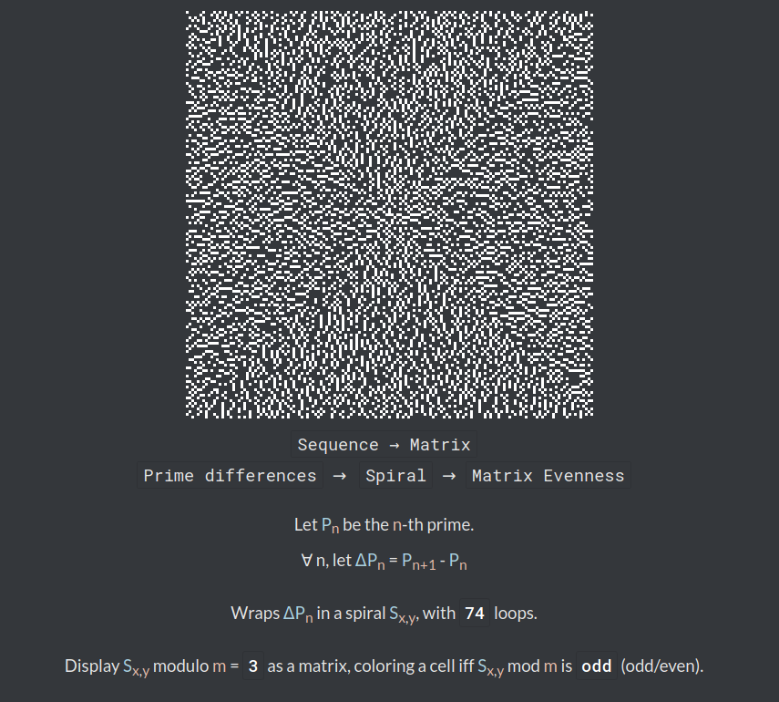
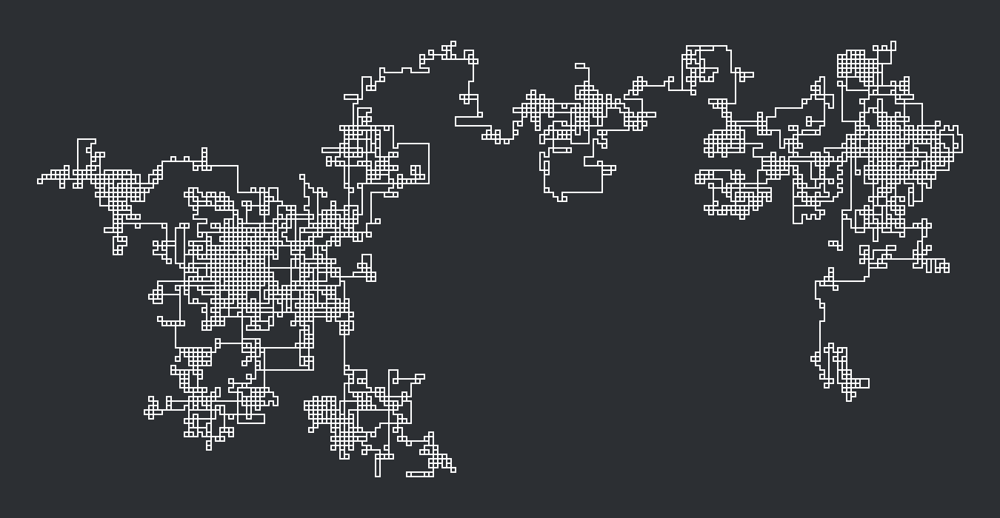

# Geometrical visualizations

Visualize integer sequences and other mathematically-defined objects in your browser!
[You can see it live here!](https://shadamethyst.xyz/geometrical-visualizations/)

This small project aims to provide entertaining and interesting geometrical visualizations of common mathematical objects, like sequences, matrices, etc.
The interface lets the user select which sequence/matrix/etc. is visualized, the visualization method used and tweak several of their parameters.

The included backend uses `Node.js`, which serves a simple website.
The website can be used statically as well.

## Inspiration

This project is inspired by [Jacob Yatsko's video](https://www.youtube.com/watch?v=o1eLKODSCqw) on visualizing the Fibonacci sequence with moduli.

## Screenshots

Here are a few screenshots of my favorite pictures generated by the website:



*Interesting pattern that arises when wrapping the difference between primes on a spiral and plotting the values where `Pₙ % 6 = 2`.*



*Turtle driven by the Collatz Length ("Flight Length")*


*Fibonacci sequence modulo 23 driving a turtle, turning left on even numbers and right on odd numbers.*

## Installation

```
git clone https://github.com/adri326/geometrical-visualizations
cd geometrical-visualizations
npm i
cp settings.json.sample settings.json
```

You should then edit `settings.json` to fit your needs.

## Usage

Simply run the server with:

```
node .
```

The server will then be listening on the port specified in `settings.json` (8080 by default).
If you are running it on your machine, then you can navigate to `localhost:8080` (or the port that you set in `settings.json`) and start fiddling.

## Performance

Javascript's `BigInt`s are used in this app, and some visualizators may start querying a lot of values, depending on their parameters.
It can thus take a few seconds to visualize it.

Sequences are cached, as to not re-generate their terms when not needed.

## Implementing your own sequences / visualizations

### Sequences

Sequences are [generator functions](https://developer.mozilla.org/en-US/docs/Web/JavaScript/Reference/Statements/function*) that yield [BigInts](https://developer.mozilla.org/en-us/docs/Web/JavaScript/Reference/Global_Objects/BigInt).
They take as argument a `settings` object, in which the settings entered by the user are stored.

You will also need to give such function some additionnal properties:
- `display_name`, used for displaying the name of the sequence (`Collatz Sequence`, `Fibonacci`, etc.)
- `var`, the name of the mathematical variable representing the sequence (`Fₙ`, `p(n)`, etc.)
- `settings`, HTML code for the formal, mathematical definition of the sequence, which also includes the fields that the user can edit to change the parameters (see example below).
  The parameters are encoded as follows: `{`, function name, `.`, parameter name, `=`, default value, `}`.

### Sample sequence

```js
/// Returns the natural numbers, starting from `n`
// Note the `*`!
function* natural_numbers(settings) {
    let n = BigInt(settings.natural_numbers.start); // This parameter is defined below in the `settings` field

    // NOTE: Infinite loops are fine in generator functions, as they are interrupted between each call to `next()`
    // You must, however, make sure that the function `yields` values in a timely fashion
    while (true) {
        yield n; // Yield the current value of `n`
        n = n + 1n; // Increment `n`
    }
}

// This is the displayed name of the sequence
natural_numbers.display_name = "Natural numbers";

// This is the algebraic name of the sequence, used by the visualization's description
natural_numbers.var = `<span class="variable one">u</span><sub><span class="variable two">n</span></sub>`;

// This is the formal definition of the sequence; it is stored in a `ul`, so you should enclose each line with `<li>` `</li>`
natural_numbers.settings = `
<li>
    Let <span class="variable one">u</span><sub><span class="variable two">n</span></sub> be the sequence of successive, natural numbers.
</li>
<li>
    <!-- Note the bracket-enclosed field! -->
    <span class="variable one">u</span><sub>0</sub> = {natural_numbers.start=0}
</li>
<li>
    ∀ <span class="variable two">n</span>,
    <span class="variable one">u</span><sub><span class="variable two">n</span> + 1</sub>
    = <span class="variable one">u</span><sub><span class="variable two">n</span></sub> + 1
</li>
`;
```

When displayed, the "Settings" field will look like this:

```
Let uₙ be the sequence of successive, natural numbers.
u₀ = [0]
∀ n, uₙ₊₁ = uₙ + 1
```

Moreover, the visualization's description will use `uₙ`.

### Visualization

Visualizators are functions, that take as arguments a [`CanvasRenderingContext2D`](https://developer.mozilla.org/en-US/docs/Web/API/CanvasRenderingContext2D), a generator function (usually an instance of `CacheSeq`) and a `settings` object.

You will also need to give such function some additionnal properties:
- `display_name`, used for displaying the name of the sequence (`Modulus Circle`, `Bar Graph`, etc.)
- `settings`, HTML code for the formal, mathematical definition of the sequence, which also includes the fields that the user can edit to change the parameters (see example below).
  The parameters are encoded as follows: `{`, function name, `.`, parameter name, `=`, default value, `}`.
  You can input the sequence's algebraic name by typing `{var}`.

### Sample visualization

```js
/// Prints the values of the sequence
function print_values(ctx, seq, settings) {
    let font_size = +settings.print_values.font_size;

    // Invalid parameter, don't display anything!
    if (isNaN(font_size) || font_size <= 0) return;

    // Set font
    ctx.font = font_size + "px sans-serif";
    // settings.colors contains two colors, `main` and `bg`
    ctx.fillStyle = settings.colors.main;

    // Main loop
    for (let y = 0; y < ctx.height; y += font_size + 2) {
        let next = seq.next();
        // `next` is now an object containing a `value` field and a `done` field
        // `value` is either undefined or contains the sequence's current value
        // `done` is a boolean, representing whether or not the sequence is finished

        // Check the the value isn't undefined
        if (next.value !== undefined) {
            ctx.fillText(String(next.value), 0, y);
        }

        // If the sequence is done, we stop
        if (next.done) break;
    }
}

// Set the display name
print_values.display_name = "Print values";

// Formal description of the visualization; note the use of `{var}`
print_values.settings = `
<li>
    Print the values of {var} (font size: {print_values.font_size=14}).
</li>
`;
```

This is what the settings will look like when rendered with as sequence the previously-defined sequence:

```
Print the values of uₙ (font-size: [14])
```
